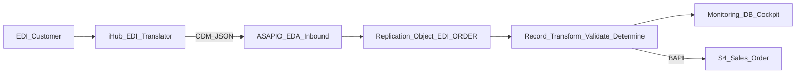
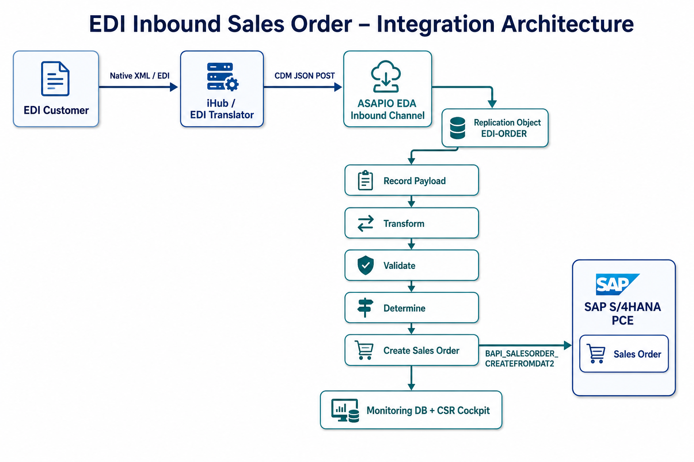
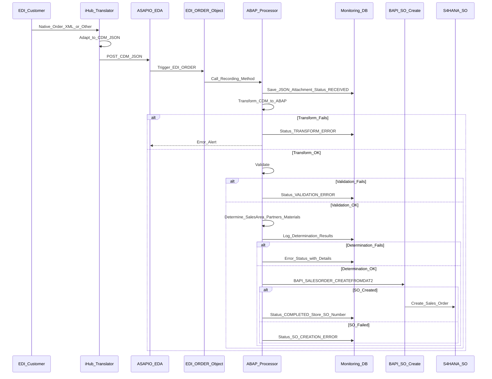
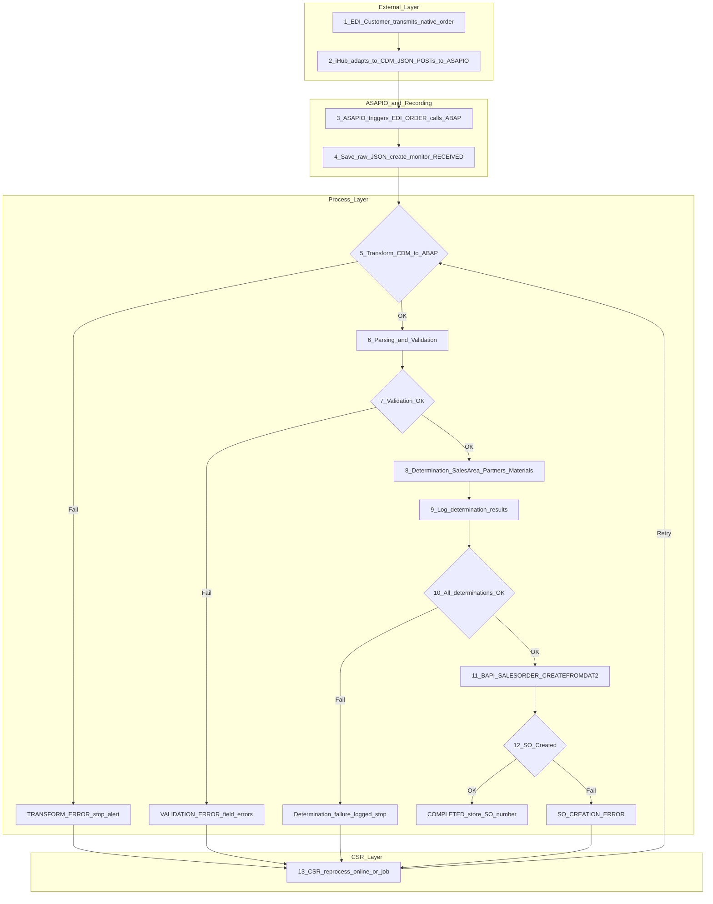
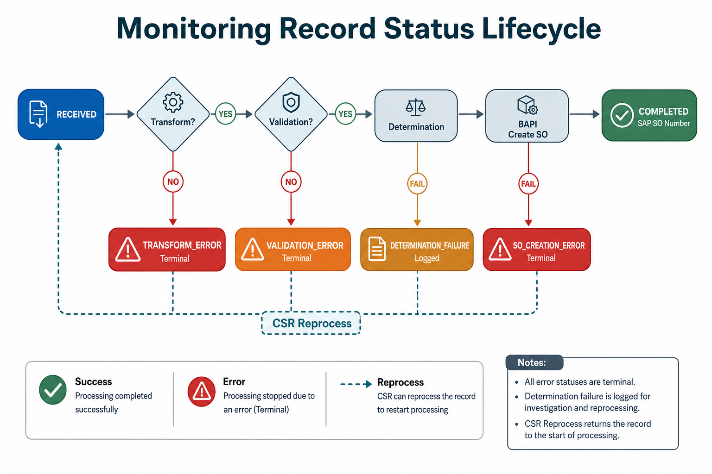
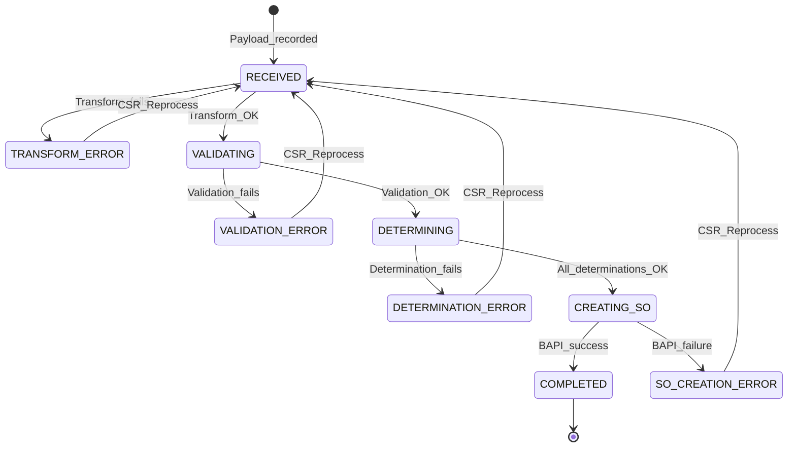
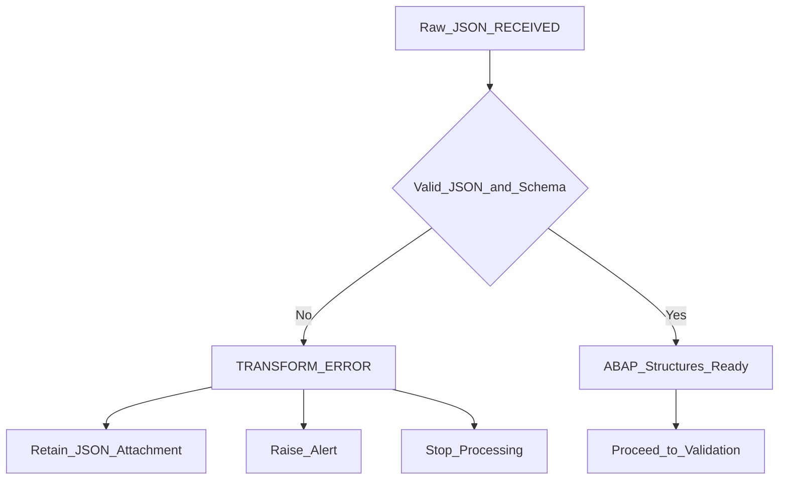
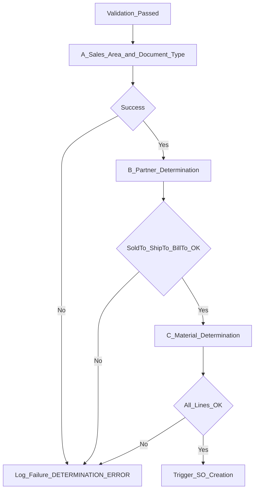
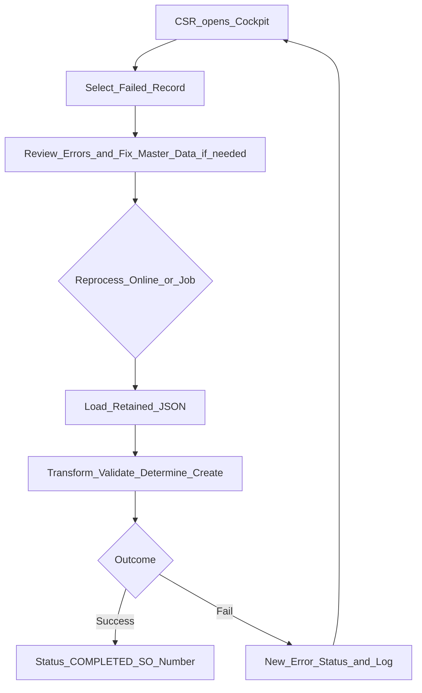

# Functional Specification

## EDI Inbound Sales Order Interface — SAP S/4HANA Private Cloud Edition

| Attribute | Value |
|-----------|--------|
| **Document ID** | FS-EDI-SO-INB-001 |
| **Title** | Interface to Receive CDM JSON Payload and Generate Sales Order in SAP S/4HANA PCE |
| **Version** | 0.1 (Draft) |
| **Status** | Draft for Review |
| **System** | SAP S/4HANA Private Cloud Edition |
| **Interface** | iHub / EDI Translator → ASAPIO EDA Inbound → Replication Object `EDI-ORDER` |
| **Primary API** | `BAPI_SALESORDER_CREATEFROMDAT2` |
| **Related Spec** | *Edi Order POST.xlsx* (CDM JSON contract — authoritative for field paths) |
| **Audience** | Functional Consultants, ABAP Developers, Integration Architects, CSR Process Owners, Test Leads |

---

## Revision History

| Version | Date | Author | Description |
|---------|------|--------|-------------|
| 0.1 | 2026-07-22 | Functional Design | Initial draft from To-Be process; assumed CDM catalog pending Excel reconciliation |

> **CDM Mapping Note:** Sections describing CDM field names and JSON paths use an **assumed logical catalog** derived from the To-Be process. **Appendix A** is the designated mapping register. Once *Edi Order POST.xlsx* is reconciled, Appendix A becomes authoritative and assumed names in the body must be updated accordingly.

---

## Table of Contents

1. [Purpose & Scope](#1-purpose--scope)
2. [Business Context & Objectives](#2-business-context--objectives)
3. [Assumptions & Dependencies](#3-assumptions--dependencies)
4. [As-Is / To-Be Overview](#4-as-is--to-be-overview)
5. [Architecture Overview](#5-architecture-overview)
6. [Detailed To-Be Process](#6-detailed-to-be-process)
7. [Status Model](#7-status-model)
8. [Interface Contract](#8-interface-contract)
9. [CDM Payload — Assumed Catalog](#9-cdm-payload--assumed-catalog)
10. [Transformation](#10-transformation)
11. [Parsing & Validation](#11-parsing--validation)
12. [Determination Logic](#12-determination-logic)
13. [Sales Order Creation](#13-sales-order-creation)
14. [Monitoring & CSR Cockpit](#14-monitoring--csr-cockpit)
15. [Alerts & Error Handling](#15-alerts--error-handling)
16. [Security, Authorization & Audit](#16-security-authorization--audit)
17. [Non-Functional Requirements](#17-non-functional-requirements)
18. [Test Scenarios](#18-test-scenarios)
19. [Open Points & Follow-ups](#19-open-points--follow-ups)
20. [Appendices](#20-appendices)

---

## 1. Purpose & Scope

### 1.1 Purpose

This Functional Specification defines the requirements for an inbound interface that:

1. Receives an EDI customer order adapted by iHub into **CDM JSON** format.
2. Posts the payload into **SAP S/4HANA Private Cloud Edition** via the **ASAPIO EDA** inbound channel.
3. Persists the raw payload for monitoring and audit.
4. Transforms, validates, and determines sales-relevant master data.
5. Creates a **Sales Order** using `BAPI_SALESORDER_CREATEFROMDAT2`.
6. Provides Customer Service Representatives (CSRs) with a monitoring cockpit to inspect failures and **manually reprocess** failed payloads (online or via background job).

### 1.2 In Scope

| ID | Scope Item |
|----|------------|
| IN-01 | Inbound CDM JSON reception via ASAPIO EDA and Replication Object `EDI-ORDER` |
| IN-02 | Raw JSON payload recording with attachment and monitoring record lifecycle |
| IN-03 | CDM-to-ABAP structure transformation |
| IN-04 | Parsing and validation (including Customer PO Date and mandatory fields) |
| IN-05 | Sales Area & Document Type determination (source GLN / vendor RC GLN) |
| IN-06 | Partner determination (Sold-to, Ship-to, Bill-to) from GLN / location references |
| IN-07 | Material determination (material ref, representative item, customer material, GTIN/EAN/UPC) |
| IN-08 | Sales Order creation via `BAPI_SALESORDER_CREATEFROMDAT2` |
| IN-09 | Monitoring cockpit, status updates, error logging, CSR reprocess |
| IN-10 | Alerting on transform / validation / SO creation failures |

### 1.3 Out of Scope

| ID | Out of Scope Item |
|----|-------------------|
| OUT-01 | Outbound EDI confirmations, ASN, invoice, or order response messages |
| OUT-02 | Native EDI/XML translation logic inside SAP (owned by iHub / EDI Translator) |
| OUT-03 | Master data creation (customers, materials, GLN assignments) — assumed pre-maintained |
| OUT-04 | Pricing procedure redesign beyond standard BAPI population from determined data |
| OUT-05 | Replacement of ASAPIO with alternative middleware |
| OUT-06 | Exact CDM JSON field path finalization until *Edi Order POST.xlsx* is reconciled (Appendix A) |

---

## 2. Business Context & Objectives

### 2.1 Business Problem

EDI customers transmit purchase orders in native formats (XML or other). The enterprise requires a controlled, auditable path from translated CDM JSON into SAP Sales Orders, with clear failure visibility for CSRs and safe reprocessing without re-sending from the trading partner when appropriate.

### 2.2 Objectives

| ID | Objective | Success Measure |
|----|-----------|-----------------|
| BO-01 | Automate Sales Order creation from EDI CDM JSON | Happy-path orders reach status `COMPLETED` with SAP SO number |
| BO-02 | Preserve raw payload for audit and reprocess | Every inbound message stored with attachment |
| BO-03 | Fail fast with actionable errors | Field-level / partner-level / line-level error details on monitoring record |
| BO-04 | Enable CSR recovery | Failed records reprocessable from cockpit or background job |
| BO-05 | Traceability | Monitoring record links CDM payload → determination results → SAP SO |

### 2.3 Actors

| Actor | Role |
|-------|------|
| EDI Customer | Transmits native order to iHub |
| iHub / EDI Translator | Adapts native format to CDM JSON; POSTs to ASAPIO |
| ASAPIO EDA | Inbound channel; triggers Replication Object `EDI-ORDER` |
| SAP Processing Layer | Custom ABAP class/method: record, transform, validate, determine, create SO |
| CSR | Monitors cockpit; corrects master data / reprocesses |
| Support / Integration Ops | Alerts, channel health, ASAPIO configuration |

---

## 3. Assumptions & Dependencies

| ID | Assumption / Dependency |
|----|-------------------------|
| AD-01 | ASAPIO EDA inbound channel is configured and reachable from iHub |
| AD-02 | Custom Replication Object **`EDI-ORDER`** is registered and bound to the ABAP recording class/method |
| AD-03 | CDM JSON schema conforms to *Edi Order POST.xlsx* (authoritative); this FS uses assumed logical names until reconciled |
| AD-04 | Customer masters hold GLN / location mappings required for partner determination |
| AD-05 | Material masters and customer-material / GTIN/EAN/UPC mappings exist for determination |
| AD-06 | Customizing exists (or will exist) for Sales Area & Document Type determination by source GLN / vendor RC GLN |
| AD-07 | BAPI authorization and sales document type customizing allow automated SO creation |
| AD-08 | Monitoring interface database (Z-tables or equivalent) and attachment store are available |
| AD-09 | Alerting infrastructure (email, workflow, or Ops channel) is available for failure notifications |

---

## 4. As-Is / To-Be Overview

### 4.1 As-Is (Assumed)

Orders may arrive through fragmented EDI paths with limited end-to-end monitoring inside S/4HANA, inconsistent error capture, and manual CSR intervention without a standardized reprocess cockpit tied to the raw CDM payload.

### 4.2 To-Be (Target)

A single inbound pipeline: **EDI → iHub (CDM JSON) → ASAPIO → EDI-ORDER → Record → Transform → Validate → Determine → Create SO**, with a monitoring record at every stage and CSR-driven reprocess for recoverable failures.



---

## 5. Architecture Overview

### 5.1 Logical Architecture



**Figure 1 — Integration Architecture:** EDI Customer → iHub/EDI Translator → ASAPIO EDA → Replication Object `EDI-ORDER` → Record / Transform / Validate / Determine / Create Sales Order → Monitoring DB & CSR Cockpit; Sales Order created in SAP S/4HANA PCE via `BAPI_SALESORDER_CREATEFROMDAT2`.

### 5.2 Component Responsibilities

| Component | Responsibility |
|-----------|----------------|
| EDI Customer | Sends order in native format |
| iHub / EDI Translator | Maps native → CDM JSON; HTTP/POST to ASAPIO inbound |
| ASAPIO EDA Inbound | Accepts payload; invokes Replication Object `EDI-ORDER` |
| Replication Object `EDI-ORDER` | Calls registered ABAP class/method |
| Recording Method | Saves raw JSON + attachment; creates monitoring record `RECEIVED` |
| Transformation | Maps CDM JSON → ABAP structures |
| Validation | Business/technical checks; field-level errors |
| Determination | Sales area, doc type, partners, materials |
| SO Creation | Calls `BAPI_SALESORDER_CREATEFROMDAT2`; commits on success |
| Monitoring Cockpit | CSR view, status, errors, reprocess actions |
| Alerting | Notifies on defined failure statuses |

### 5.3 Sequence Overview



---

## 6. Detailed To-Be Process

### 6.1 Process Swimlane (Steps 1–13)



### 6.2 Step-by-Step Functional Requirements

#### Step 1 — EDI Customer Transmission

| FR ID | Requirement |
|-------|-------------|
| FR-001 | EDI customer shall transmit the purchase order to iHub/EDI Translator in the agreed native format (XML or other). |
| FR-002 | SAP shall not parse the native format; responsibility for adaptation remains with iHub. |

#### Step 2 — iHub Adaptation and POST

| FR ID | Requirement |
|-------|-------------|
| FR-003 | iHub shall adapt the native payload to **CDM JSON** as specified in *Edi Order POST.xlsx*. |
| FR-004 | iHub shall POST the CDM JSON to SAP S/4HANA via the **ASAPIO EDA inbound channel**. |
| FR-005 | The POST shall be synchronous from an interface-contract perspective (HTTP response semantics per ASAPIO channel design); business processing may continue asynchronously within SAP after acceptance. |

#### Step 3 — ASAPIO Triggers Replication Object

| FR ID | Requirement |
|-------|-------------|
| FR-006 | Upon receipt, ASAPIO shall trigger custom Replication Object **`EDI-ORDER`**. |
| FR-007 | `EDI-ORDER` shall call the registered ABAP class/method for payload recording and subsequent processing. |

#### Step 4 — Payload Recording

| FR ID | Requirement |
|-------|-------------|
| FR-008 | The recording method shall save the **raw JSON payload** into the monitoring interface database **with attachment**. |
| FR-009 | A monitoring record shall be created with status **`RECEIVED`**. |
| FR-010 | The monitoring record shall capture technical metadata: receipt timestamp, message/correlation ID (if provided), source system indicator, payload size, and processing user/system. |

#### Step 5 — Transformation

| FR ID | Requirement |
|-------|-------------|
| FR-011 | The system shall attempt **CDM-to-ABAP structure transformation**. |
| FR-012 | If transformation fails: status → **`TRANSFORM_ERROR`**; JSON payload retained; processing stops; **alert raised**. |
| FR-013 | Transform errors shall record technical reason (e.g., invalid JSON, unexpected schema node, type conversion failure). |

#### Step 6–7 — Parsing & Validation

| FR ID | Requirement |
|-------|-------------|
| FR-014 | If transformation succeeds, **Parsing & Validation** shall execute (e.g., Customer PO Date validity, mandatory field presence). |
| FR-015 | Validation results shall be logged against the monitoring record. |
| FR-016 | If validation fails: status → **`VALIDATION_ERROR`**; **error details recorded per field**; processing stops (no determination / SO create). |

#### Step 8–9 — Determination

| FR ID | Requirement |
|-------|-------------|
| FR-017 | If validation passes, determination shall run **in sequence**: (a) Sales Area & Document Type; (b) Sold-to / Ship-to / Bill-to; (c) Material. |
| FR-018 | Determination results shall be logged on the monitoring record (success/failure **per partner** and **per line item material**). |
| FR-019 | If any mandatory determination fails, processing shall stop before SO creation; failure details remain on the monitoring record for CSR action. |

#### Step 10–12 — Sales Order Creation

| FR ID | Requirement |
|-------|-------------|
| FR-020 | If all determinations succeed, Sales Order creation shall be triggered via **`BAPI_SALESORDER_CREATEFROMDAT2`**. |
| FR-021 | On success: status → **`COMPLETED`**; **SAP Sales Order number** stored on the monitoring record. |
| FR-022 | On failure: status → **`SO_CREATION_ERROR`**; specific error messages captured (Sales Org, Sold-to, Ship-to, material line-level, and BAPI return messages). |

#### Step 13 — CSR Reprocess

| FR ID | Requirement |
|-------|-------------|
| FR-023 | CSR shall be able to **manually reprocess** any failed payload from the monitoring cockpit (online). |
| FR-024 | Reprocess shall also be supported via **background job** for eligible failed statuses. |
| FR-025 | Reprocess shall reuse the retained raw JSON (not require a new POST from iHub) unless a new inbound message is intentionally sent. |
| FR-026 | Each reprocess attempt shall be audited (who, when, from-status, to-status, result). |

---

## 7. Status Model

### 7.1 Status Lifecycle Diagram



**Figure 2 — Monitoring Record Status Lifecycle** (including CSR reprocess loop).



> **Note:** Intermediate statuses `VALIDATING`, `DETERMINING`, and `CREATING_SO` may be persisted for observability or treated as transient in-memory phases. Minimum persisted business statuses required by the To-Be process are: `RECEIVED`, `TRANSFORM_ERROR`, `VALIDATION_ERROR`, `SO_CREATION_ERROR`, `COMPLETED`. Determination failures shall be clearly logged; if a dedicated status is preferred for filtering in the cockpit, use **`DETERMINATION_ERROR`** (recommended).

### 7.2 Status Glossary

| Status | Meaning | Terminal? | Reprocessable? | Alert? |
|--------|---------|-----------|----------------|--------|
| `RECEIVED` | Raw JSON saved; processing not yet complete | No | N/A (in progress) | No |
| `TRANSFORM_ERROR` | CDM → ABAP transform failed | Yes (error) | Yes | Yes |
| `VALIDATION_ERROR` | Parsing/validation failed | Yes (error) | Yes | Yes |
| `DETERMINATION_ERROR` | One or more determinations failed | Yes (error) | Yes | Yes |
| `SO_CREATION_ERROR` | BAPI create failed | Yes (error) | Yes | Yes |
| `COMPLETED` | Sales Order created; SO number stored | Yes (success) | No (default) | No |

---

## 8. Interface Contract

### 8.1 Channel

| Attribute | Specification |
|-----------|---------------|
| Protocol | ASAPIO EDA inbound channel (HTTP/HTTPS as configured) |
| Payload | CDM JSON (UTF-8) |
| Trigger | Replication Object `EDI-ORDER` |
| Content type | `application/json` (assumed; confirm with ASAPIO channel config) |

### 8.2 Payload Retention

| Requirement | Detail |
|-------------|--------|
| Raw payload | Always stored on first receipt |
| Attachment | JSON stored as monitoring attachment (GOS / content repository / custom store — implementation decision) |
| Retention | Payload retained on all error paths; not deleted on transform/validation failure |
| PII / commercial data | Subject to enterprise retention and data protection policy |

### 8.3 Correlation & Idempotency (Defaults)

| Topic | Default Rule (confirm in design workshop) |
|-------|---------------------------------------------|
| Correlation ID | Prefer inbound header/body message ID if present in CDM; else generate UUID at recording |
| Duplicate POST | If same correlation ID already `COMPLETED`, reject or mark duplicate without creating second SO (configurable) |
| Reprocess | Does not create a new inbound correlation; creates a new processing attempt linked to the same monitoring root record |

### 8.4 Synchronous Acknowledgement (Technical)

ASAPIO/iHub technical acknowledgement confirms **acceptance for processing**, not business completion. Business outcome is reflected only on the monitoring record (`COMPLETED` or error status).

---

## 9. CDM Payload — Assumed Catalog

> **Disclaimer:** Field names and JSON paths below are **provisional / assumed** for functional design. Exact paths, cardinalities, and enumerations must be taken from *Edi Order POST.xlsx* and recorded in **Appendix A**.

### 9.1 Logical Header

| Logical Field | Assumed Use | Used By |
|---------------|-------------|---------|
| `messageId` / correlation ID | Idempotency, audit | Recording |
| `customerPONumber` | PO reference on SO | Validation, BAPI |
| `customerPODate` | Date validity check | Validation, BAPI |
| `orderDate` | Document date if distinct | BAPI |
| `currency` | Document currency | Validation, BAPI |
| `requestedDeliveryDate` | Header RDD | Validation, BAPI |
| `sourceGLN` | Sales area / doc type determination | Determination |
| `vendorRcGLN` | Sales area / doc type determination | Determination |
| `incoterms` / payment terms (if present) | Optional SO fields | BAPI (if mapped) |

### 9.2 Logical Partners / Locations

| Logical Field | Assumed Use | Partner Function |
|---------------|-------------|------------------|
| `soldTo.gln` / `soldTo.locationRef` | Sold-to determination | AG (Sold-to) |
| `shipTo.gln` / `shipTo.locationRef` / `destination` | Ship-to determination | WE (Ship-to) |
| `billTo.gln` / `billTo.locationRef` | Bill-to determination | RE (Bill-to) |

### 9.3 Logical Line Items

| Logical Field | Assumed Use |
|---------------|-------------|
| `lineNumber` | Item number mapping / error attribution |
| `quantity` | Order quantity |
| `uom` | Unit of measure |
| `requestedDeliveryDate` | Item RDD |
| `materialReference` | Material determination input |
| `representativeItem` | Material determination input |
| `customerMaterialReference` | Customer-material determination |
| `gtin` / `ean` / `upc` | GTIN/EAN/UPC determination |
| `unitPrice` (if present) | Optional price override — confirm policy |

### 9.4 Illustrative Sample (Non-Normative)

See [Appendix C](#appendix-c--sample-illustrative-cdm-json). This sample is illustrative only and must not be used as the production contract.

---

## 10. Transformation

### 10.1 Purpose

Convert inbound CDM JSON into typed ABAP structures used by validation, determination, and BAPI mapping.

### 10.2 Functional Rules

| FR ID | Rule |
|-------|------|
| FR-030 | Transformation shall be deterministic and version-aware if CDM schema versions are introduced. |
| FR-031 | Unknown optional nodes may be ignored; unexpected **mandatory** structural failures → `TRANSFORM_ERROR`. |
| FR-032 | Type conversion failures (date, quantity, numeric) → `TRANSFORM_ERROR` with field pointer where possible. |
| FR-033 | On failure: retain JSON; do not attempt validation or determination. |

### 10.3 Failure Behavior



---

## 11. Parsing & Validation

### 11.1 Validation Categories

| Category | Examples | Severity |
|----------|----------|----------|
| Mandatory presence | Customer PO number, PO date, at least one line, quantity, partner GLN/location as required | Error |
| Format / domain | Date format and calendar validity for Customer PO Date; quantity > 0 | Error |
| Consistency | Line numbers unique; UoM present when quantity present | Error |
| Business calendar (optional) | PO date not unreasonably in future (policy TBD) | Error or Warning (confirm) |

### 11.2 Key Rules (Initial Set)

| Rule ID | Check | On Failure |
|---------|-------|------------|
| VAL-001 | `customerPODate` present and valid date | `VALIDATION_ERROR`, field error on PO date |
| VAL-002 | `customerPONumber` present and non-blank | Field error |
| VAL-003 | At least one line item present | Header-level error |
| VAL-004 | Each line: quantity present and > 0 | Line-level field error |
| VAL-005 | Each line: at least one material identification input present (material ref **or** representative item **or** customer material **or** GTIN/EAN/UPC) | Line-level field error |
| VAL-006 | Sold-to and Ship-to identification present per CDM contract | Partner field errors |
| VAL-007 | Currency present if required by contract | Field error |

### 11.3 Logging

| FR ID | Requirement |
|-------|-------------|
| FR-040 | Every validation finding shall be logged against the monitoring record with: field path, line number (if item), severity, message code, message text. |
| FR-041 | Multiple field errors may be collected in one pass (preferred) before setting `VALIDATION_ERROR`. |

---

## 12. Determination Logic

Determination executes **only after successful validation**, in the following **strict sequence**.



### 12.1 A — Sales Area & Document Type

| Input | Logic (Functional) | Output |
|-------|--------------------|--------|
| `sourceGLN` | Lookup customizing / mapping table for sales organization, distribution channel, division | Sales Area |
| `vendorRcGLN` | Combined or secondary key for doc type / sales area resolution | Document Type (`AUART`) |
| — | If no unique match → determination failure | Error logged |

**FR-050:** Determination based on **source GLN / vendor RC GLN** as specified in To-Be step 8a.  
**FR-051:** Result logged (success with resolved values, or failure with keys used).

### 12.2 B — Partner Determination

| Partner | Typical Inputs | Output |
|---------|----------------|--------|
| Sold-to | `soldTo` GLN / location reference | Customer number (KUNNR) + partner function AG |
| Ship-to | `destination` / `shipTo` GLN / location reference | Customer number + WE |
| Bill-to | `billTo` GLN / location reference | Customer number + RE |

**FR-052:** Each partner determination result logged as success or failure.  
**FR-053:** Failure of any mandatory partner stops processing before material determination completion requirement — recommended: finish logging all partner attempts, then stop (CSR visibility). Bill-to may default to Sold-to if CDM omits bill-to **only if** business rule confirms (Open Point OP-04).

### 12.3 C — Material Determination

For each line item, resolve SAP material number using inputs in priority order (confirm priority in workshop; recommended default below):

| Priority | Input | Lookup |
|----------|-------|--------|
| 1 | `materialReference` | Direct material / mapping |
| 2 | `representativeItem` | Representative item mapping |
| 3 | `customerMaterialReference` | Customer-material info record / mapping |
| 4 | `gtin` / `ean` / `upc` | GTIN/EAN/UPC → material |

**FR-054:** Material determination success/failure logged **per line item**.  
**FR-055:** If any line fails material determination → overall determination failure; no SO creation.  
**FR-056:** Resolved material, plant (if determined), and UoM conversion notes (if any) stored on monitoring line log.

### 12.4 Determination Logging Structure (Logical)

| Level | Attributes |
|-------|------------|
| Header | Sales Org, Dist. Channel, Division, Doc Type, overall determination status |
| Partner | Partner function, input GLN/location, resolved customer, status, message |
| Item | Line number, input keys tried, resolved material, status, message |

---

## 13. Sales Order Creation

### 13.1 API Selection

| Choice | Decision |
|--------|----------|
| Primary | `BAPI_SALESORDER_CREATEFROMDAT2` |
| Alternative (future) | S/4HANA OData / SD Billing-related API **not** used for order create in this FS; SD Billing APIs are out of scope for Sales Order creation. Optional future evaluation of S/4 Sales Order A2X APIs may be recorded as enhancement — not in MVP. |

### 13.2 Mapping Principles (Logical → BAPI)

| Area | Source | BAPI Target (logical) |
|------|--------|------------------------|
| Header | Determined sales area, doc type, PO number/date, dates, currency | `ORDER_HEADER_IN` |
| Partners | Determined Sold-to, Ship-to, Bill-to | `ORDER_PARTNERS` |
| Items | Determined materials, quantities, UoM, RDD | `ORDER_ITEMS_IN` / schedules |
| Conditions | Only if contractually required and validated | `ORDER_CONDITIONS_IN` (optional) |

Exact field mapping: **Appendix A**.

### 13.3 Success Path

| FR ID | Requirement |
|-------|-------------|
| FR-060 | On BAPI success and commit: monitoring status → `COMPLETED`. |
| FR-061 | Store SAP Sales Order number on monitoring header. |
| FR-062 | Store BAPI success messages in monitoring log (optional but recommended). |

### 13.4 Failure Path

| FR ID | Requirement |
|-------|-------------|
| FR-063 | On BAPI failure: status → `SO_CREATION_ERROR`; no partial commit of SO. |
| FR-064 | Capture specific messages including Sales Org, Sold-to, Ship-to, and **material line-level** errors from BAPI return table. |
| FR-065 | Retain determined values and raw JSON for CSR diagnosis and reprocess. |

---

## 14. Monitoring & CSR Cockpit

### 14.1 Monitoring Record (Logical Data Model)

| Entity | Key Content |
|--------|-------------|
| Header | Monitoring ID, correlation ID, status, timestamps, SO number, source GLN, PO number, error summary |
| Attachment | Raw CDM JSON |
| Validation log | Field path, message |
| Determination log | Sales area / partners / materials |
| Process attempts | Attempt number, user/job, start/end, result status |
| BAPI messages | Type, ID, number, text, item reference |

### 14.2 Cockpit Capabilities

| Capability | Requirement |
|------------|-------------|
| Search / filter | By status, date, PO number, SO number, GLN, correlation ID |
| Detail view | Payload attachment, validation errors, determination results, BAPI messages |
| Reprocess (online) | Authorized CSR triggers reprocess for failed statuses |
| Reprocess (job) | Background job selects failed records by status/age/variant |
| Audit | Display reprocess history |

### 14.3 Reprocess Flow



**FR-070:** Reprocess shall not overwrite historical attempt logs; append new attempt.  
**FR-071:** Default eligible statuses: `TRANSFORM_ERROR`, `VALIDATION_ERROR`, `DETERMINATION_ERROR`, `SO_CREATION_ERROR`.  
**FR-072:** `COMPLETED` records are not reprocessed by default (prevent duplicate SO).

---

## 15. Alerts & Error Handling

### 15.1 Alert Triggers

| Event | Alert |
|-------|-------|
| `TRANSFORM_ERROR` | Yes |
| `VALIDATION_ERROR` | Yes (may be batched / severity-filtered — confirm) |
| `DETERMINATION_ERROR` | Yes |
| `SO_CREATION_ERROR` | Yes |
| `COMPLETED` | No |

### 15.2 Alert Content (Minimum)

- Monitoring ID / correlation ID  
- Status  
- Customer PO number (if available)  
- Timestamp  
- Short error summary (first N messages)  
- Link/reference to cockpit record (if available)

### 15.3 Error Handling Principles

| Principle | Detail |
|-----------|--------|
| Fail closed | Do not create SO when prior stage fails |
| Retain evidence | Always keep JSON attachment |
| Actionable detail | Prefer field / partner / line attribution |
| No silent discard | Every accepted POST yields a monitoring record |

---

## 16. Security, Authorization & Audit

| Area | Requirement |
|------|-------------|
| Channel security | TLS and ASAPIO authentication/authorization per landscape standards |
| Cockpit display | Authorization object(s) for display vs reprocess |
| Payload access | Restrict raw JSON display to authorized roles (may contain commercial terms) |
| Reprocess | Separate authorization; all attempts audited with user ID and timestamp |
| Change documents | Prefer append-only process attempt history |

---

## 17. Non-Functional Requirements

| ID | Category | Requirement (Initial Target) |
|----|----------|------------------------------|
| NFR-01 | Reliability | No acknowledged payload lost without monitoring record |
| NFR-02 | Performance | Typical single-order process (transform→SO) within agreed SLA (default target: &lt; 30 seconds under normal load — confirm) |
| NFR-03 | Volume | Support agreed peak orders/hour (placeholder — confirm with business) |
| NFR-04 | Scalability | Background reprocess job chunkable by package size |
| NFR-05 | Observability | Status and error metrics available for Ops |
| NFR-06 | Recoverability | Failed records reprocessable without partner resend |
| NFR-07 | Compatibility | S/4HANA Private Cloud Edition; ASAPIO EDA version as installed |

---

## 18. Test Scenarios

| ID | Scenario | Expected Result |
|----|----------|-----------------|
| TS-01 | Happy path — valid CDM, all determinations resolve | `COMPLETED` + SO number |
| TS-02 | Malformed JSON | `TRANSFORM_ERROR`; alert; payload retained |
| TS-03 | Valid JSON, missing mandatory PO date | `VALIDATION_ERROR`; field error on PO date |
| TS-04 | Missing line material identifiers | `VALIDATION_ERROR` line-level |
| TS-05 | Unknown source GLN | `DETERMINATION_ERROR` on sales area/doc type |
| TS-06 | Unknown ship-to GLN | Partner determination failure logged |
| TS-07 | One line GTIN unknown | Material determination failure for that line; no SO |
| TS-08 | Determinations OK; BAPI rejects material/sales area | `SO_CREATION_ERROR` with BAPI messages |
| TS-09 | CSR reprocess after master data fix | New attempt → `COMPLETED` |
| TS-10 | Background job reprocess of eligible failures | Same as online; audit shows job user |
| TS-11 | Duplicate correlation after `COMPLETED` | No second SO (per idempotency rule) |
| TS-12 | Bill-to omitted (if default rule approved) | Bill-to = Sold-to; SO created |

---

## 19. Open Points & Follow-ups

| ID | Topic | Action Needed |
|----|-------|---------------|
| OP-01 | Exact CDM JSON paths | Reconcile with *Edi Order POST.xlsx* → update Appendix A |
| OP-02 | Alert channel | Confirm email / Fiori notification / Ops tool |
| OP-03 | Z-table / class naming | Technical design to assign repository objects |
| OP-04 | Bill-to defaulting | Confirm if Bill-to defaults to Sold-to when omitted |
| OP-05 | Material determination priority | Confirm order of material ref / representative / cust-mat / GTIN |
| OP-06 | Idempotency key | Confirm CDM field for message ID |
| OP-07 | Attachment store | GOS vs content repository vs custom |
| OP-08 | Persist intermediate statuses | Confirm whether `VALIDATING` / `DETERMINING` are stored |
| OP-09 | Volume & SLA | Business to confirm peak volume and runtime SLA |
| OP-10 | Plant / storage location determination | Confirm if required beyond BAPI defaults |

---

## 20. Appendices

### Appendix A — CDM ↔ ABAP / BAPI Field Mapping

> **Status:** Placeholder register — **to be finalized from *Edi Order POST.xlsx***.  
> When the Excel is uploaded and reconciled, this appendix becomes the **authoritative** field contract. Assumed names in Section 9 must be aligned.

#### A.1 Header Mapping

| CDM Path (from Excel) | Description | ABAP Field / Structure | BAPI Field | Mandatory | Transform Notes | Status |
|-----------------------|-------------|------------------------|------------|-----------|-----------------|--------|
| *TBD — Edi Order POST.xlsx* | Message / correlation ID | *TBD* | — | *TBD* | | Pending Excel |
| *TBD* | Customer PO Number | *TBD* | `ORDER_HEADER_IN-PURCH_NO_C` | Yes | | Pending Excel |
| *TBD* | Customer PO Date | *TBD* | `ORDER_HEADER_IN-PURCH_DATE` | Yes | Date validation VAL-001 | Pending Excel |
| *TBD* | Source GLN | *TBD* | — (determination input) | Yes | Sales area / doc type | Pending Excel |
| *TBD* | Vendor RC GLN | *TBD* | — (determination input) | *TBD* | Sales area / doc type | Pending Excel |
| *TBD* | Currency | *TBD* | `ORDER_HEADER_IN-CURRENCY` | *TBD* | | Pending Excel |
| *TBD* | Requested delivery date | *TBD* | Header/schedule date fields | *TBD* | | Pending Excel |
| *TBD* | Document type override (if any) | *TBD* | `ORDER_HEADER_IN-DOC_TYPE` | No | Usually determined | Pending Excel |

#### A.2 Partner Mapping

| CDM Path (from Excel) | Description | Determination Input | Partner Function | BAPI Partner | Mandatory | Status |
|-----------------------|-------------|---------------------|------------------|--------------|-----------|--------|
| *TBD* | Sold-to GLN / location | Sold-to determination | AG | `ORDER_PARTNERS` | Yes | Pending Excel |
| *TBD* | Ship-to / destination GLN / location | Ship-to determination | WE | `ORDER_PARTNERS` | Yes | Pending Excel |
| *TBD* | Bill-to GLN / location | Bill-to determination | RE | `ORDER_PARTNERS` | *TBD* | Pending Excel |

#### A.3 Item Mapping

| CDM Path (from Excel) | Description | ABAP / Determination | BAPI Field | Mandatory | Status |
|-----------------------|-------------|----------------------|------------|-----------|--------|
| *TBD* | Line number | Item key | `ITM_NUMBER` | Yes | Pending Excel |
| *TBD* | Quantity | — | `TARGET_QTY` / schedule qty | Yes | Pending Excel |
| *TBD* | UoM | — | `TARGET_QU` / sales unit | *TBD* | Pending Excel |
| *TBD* | Material reference | Material determination | `MATERIAL` (after resolve) | Cond. | Pending Excel |
| *TBD* | Representative item | Material determination | `MATERIAL` (after resolve) | Cond. | Pending Excel |
| *TBD* | Customer material reference | Material determination | `MATERIAL` / `CUST_MAT` | Cond. | Pending Excel |
| *TBD* | GTIN / EAN / UPC | Material determination | `MATERIAL` (after resolve) | Cond. | Pending Excel |
| *TBD* | Item RDD | — | Schedule line date | *TBD* | Pending Excel |

#### A.4 Reconciliation Checklist (when Excel arrives)

1. Import all CDM nodes from *Edi Order POST.xlsx*.  
2. Mark mandatory/optional and cardinalities.  
3. Replace every *TBD* row above.  
4. Update Section 9 assumed catalog to match.  
5. Update sample JSON in Appendix C.  
6. Increment FS version and record revision history.

---

### Appendix B — Status Code Glossary

| Code | Description |
|------|-------------|
| `RECEIVED` | Payload recorded; awaiting / in processing |
| `TRANSFORM_ERROR` | CDM JSON could not be transformed to ABAP structures |
| `VALIDATION_ERROR` | Parsing/validation failed; see field errors |
| `DETERMINATION_ERROR` | Sales area, partner, or material determination failed |
| `SO_CREATION_ERROR` | BAPI sales order creation failed |
| `COMPLETED` | Sales order created successfully |

---

### Appendix C — Sample Illustrative CDM JSON

> **Non-normative.** For discussion only. Replace with Excel-compliant example after reconciliation.

```json
{
  "messageId": "MSG-2026-000123",
  "customerPONumber": "PO998877",
  "customerPODate": "2026-07-20",
  "currency": "EUR",
  "requestedDeliveryDate": "2026-08-01",
  "sourceGLN": "1234567890123",
  "vendorRcGLN": "9876543210987",
  "soldTo": {
    "gln": "1111111111111",
    "locationRef": "LOC-SOLD-01"
  },
  "shipTo": {
    "gln": "2222222222222",
    "locationRef": "LOC-SHIP-01"
  },
  "billTo": {
    "gln": "1111111111111",
    "locationRef": "LOC-SOLD-01"
  },
  "destination": {
    "gln": "2222222222222"
  },
  "items": [
    {
      "lineNumber": "000010",
      "quantity": 100,
      "uom": "EA",
      "requestedDeliveryDate": "2026-08-01",
      "materialReference": "",
      "representativeItem": "",
      "customerMaterialReference": "CUST-MAT-55",
      "gtin": "00012345678905",
      "ean": "",
      "upc": ""
    }
  ]
}
```

---

### Appendix D — Glossary

| Term | Definition |
|------|------------|
| **ASAPIO EDA** | Event-driven / integration framework used for the inbound channel into SAP |
| **BAPI** | Business Application Programming Interface; here `BAPI_SALESORDER_CREATEFROMDAT2` |
| **CDM** | Canonical Data Model — normalized JSON order format produced by iHub |
| **CSR** | Customer Service Representative |
| **EDI** | Electronic Data Interchange |
| **GLN** | Global Location Number — used to resolve partners and routing keys |
| **GTIN / EAN / UPC** | Product identification numbers used in material determination |
| **iHub** | EDI translation / integration hub adapting native formats to CDM JSON |
| **PCE** | Private Cloud Edition (SAP S/4HANA) |
| **Replication Object** | ASAPIO-registered object (`EDI-ORDER`) that invokes the ABAP handler |
| **RC GLN** | Vendor / receiving company GLN used in sales area / document type determination |

---

### Appendix E — Functional Requirement Index

| FR ID | Summary |
|-------|---------|
| FR-001–002 | EDI native transmission; SAP does not parse native format |
| FR-003–005 | iHub CDM adaptation and POST to ASAPIO |
| FR-006–007 | `EDI-ORDER` triggers ABAP handler |
| FR-008–010 | Raw JSON + attachment; status `RECEIVED` |
| FR-011–013 | Transform; `TRANSFORM_ERROR` + alert |
| FR-014–016 | Validation; `VALIDATION_ERROR` with field details |
| FR-017–019 | Determination sequence and logging |
| FR-020–022 | BAPI create; `COMPLETED` / `SO_CREATION_ERROR` |
| FR-023–026 | CSR online and job reprocess with audit |
| FR-030–033 | Transformation rules |
| FR-040–041 | Validation logging |
| FR-050–056 | Determination rules |
| FR-060–065 | SO creation success/failure |
| FR-070–072 | Reprocess eligibility and history |

---

*End of Functional Specification FS-EDI-SO-INB-001 v0.1 (Draft)*
